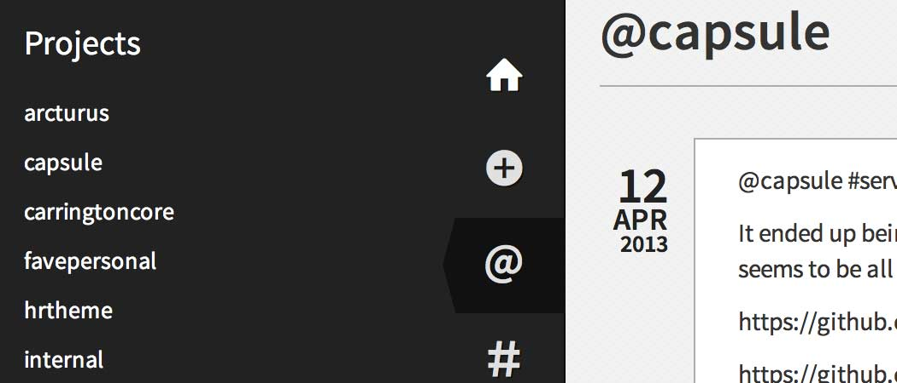

Capsule Server
==============

Turning the developer's code journal into a collaboration hub.

### Overview

Capsule Server is a collaboration hub. Developers do their independent journaling in their Capsule installs, then can choose to selectively send that content to the Capsule Server. Content is not created on the Capsule Server, it is replicated from developer's Capsule installations.

Capsule Server can serve as a shared memory for a developement team - a home for decisions, failed approaches, ideas and notes that might not make it into code comments or other documentation.

### Developers, Get Your API Key

Contributors to this Capsule Server can get their API key on their Profile page.

### Manage Projects

Create projects to determine what content the Capsule Server will accept. Each developer can then opt-in to the projects they like, and any posts in their Capsule for that project will be replicated to the Capsule Server.

### Manage Users

Add user accounts for developers who you want to contribute and/or to have access to contributed content. These developers are given the Capsule Server API URL and an API key on their Profile page. They each enter this information into their Capsule install which allows them to contribute content back to the Capsule Server.

The recommended role for Capsule API users is `subscriber`. Only give accounts to trusted users (see Security below).

### Security

_Capsule Server is designed to be used with trusted users._

For this reason, and to retain fidelity of post content, posts from Capsule instances are replicated verbatim on the Capsule Server. No KSES filtering or content sanitization is performed (regardless of user role).

To revoke a developer\\'s access, you can delete the user account. If you prefer to disable their account rather than deleting it, you can change their API key, password and email address.

As Capsule Server is expected to be used with technical teams that may use self-signed SSL certificates, Capsule is configured to automatically accept self-signed certificates when talking to a Capsule Server.

### Browse by Projects & Tags

You can quickly access Capsule Server content by project or tag using the **@** and **#** menu items.

### Search

Capsule supports both keyword search and filtering by projects, tags, code languages, developer and date range, whew! When using keyword search you can auto-complete projects, tags, and code languages by using their syntax prefix.

When filtering, multiple projects/tags/developers/etc. can be selected and are all populated with auto-complete.

### Using dnsmasq

Many local development environments take advantage of dnsmasq to have pretty links for their local projects. However, please be aware that there is a common issue affecting cURL usage on environments with dnsmasq running as a service.

As WP Capsule uses cURL to sync capsules, you might find that your local instance is not able to properly send information over to your defined WP Capsule Server.

To check if your local domain properly resolves, use the terminal command dig, followed by your local URL (eg: dig mywebsite.localhost). In the response section of the output you should see an A record pointing to 127.0.0.1.